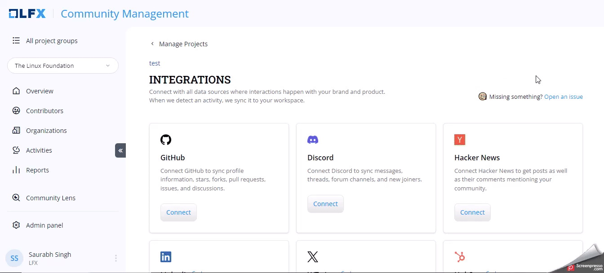

# Git Integration

After completing the GitHub integration, complete the Git integration.


Git repositories are not automatically connected when you do Git integration. You need to manually enter each Git repository URL.


1. On the **INTEGRATIONS** page, you will see all the connectors. Check for the Git connector.
2. Click Connect. On the pop-up window, enter remote URLs for each repository that you want to connect.
3. Click **+Add remote URL** to add multiple repositories. Click **Connect**.

<figure><figcaption></figcaption></figure>

Activities Collected:

* Commits
