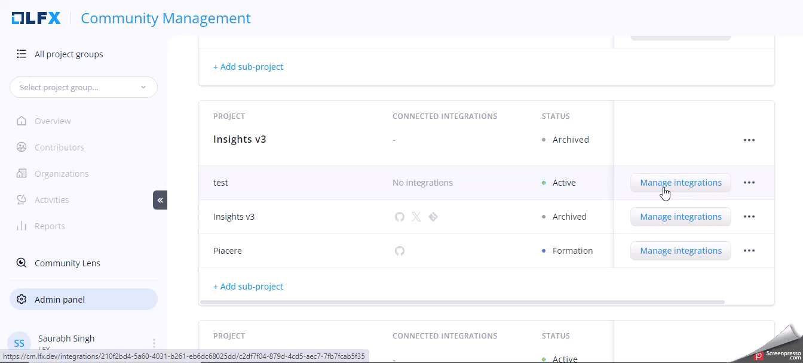

# GitHub Integration

### Connect GitHub

Follow these steps to integrate Github:

1. On the home page, search for the project group.
2. On the project card, click **Settings**.

<figure><figcaption></figcaption></figure>

3. On the [**MANAGE PROJEC**](https://cm.lfx.dev/admin/project-groups/210f2bd4-5a60-4031-b261-eb6dc68025dd/projects)[**TS**](https://cm.lfx.dev/admin/project-groups/210f2bd4-5a60-4031-b261-eb6dc68025dd/projects) page, scroll down to see the listed projects.
4. Select the project, and click **Manage Integrations** CTA.

<figure><figcaption></figcaption></figure>

5. On the **INTEGRATIONS** page, you will see all the connectors. Check the GitHub connector.
6. Click **Connect.** On the pop-up window, click **I'm the GitHub organization admin** CTA.


Only GitHub users with admin permissions can connect to CM's GitHub integration. If you are an organization member, you will need approval from the GitHub workspace admin.


<figure><figcaption></figcaption></figure>

7. On the GitHub page, install **LFX CM** to connect project repositories for the data integration.
8. Once you complete the integration, the data will start syncing from the connected repositories.
9. After GitHub is connected, hover over (1) to see the list of repositories.

<figure><figcaption></figcaption></figure>

9. Add each of these repositories to their associated project under [Git](git-integration.md) integration.

Activities Collected:

* Stars/Un-stars
* Forks
* Issues
* Pull requests
* Discussions
* Comments on issues/pull requests/discussions
* Closing of issues/pull requests/discussions
