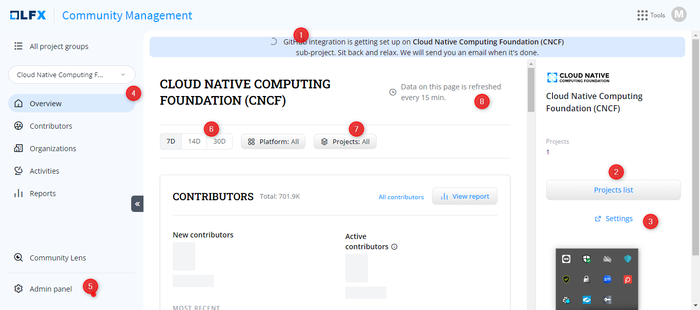

# My project groups

### Manage your project settings

1. On the **project group card**, click **Settings** CTA.
2. On the **Manage Projects** page, you can either scroll down or use the search box to see the projects listed under your project group.


If you do not see certain projects or subprojects listed in **CM,** then contact the onboarding team to add that project.&#x20;

You cannot add or delete the projects or sub-projects in your project groups.


#### Manage Integrations

1. Select the project for which you want to integrate the data sources.
2. Click **Manage Integrations** CTA.
3. On the **INTEGRATIONS**  page, select the data source that you want to integrate and follow the [integration](../integrations/) steps.

<figure><figcaption></figcaption></figure>

### View Project(s) group page

1. On the **project group card**, click **Project(s)** CTA.

<figure><figcaption></figcaption></figure>
