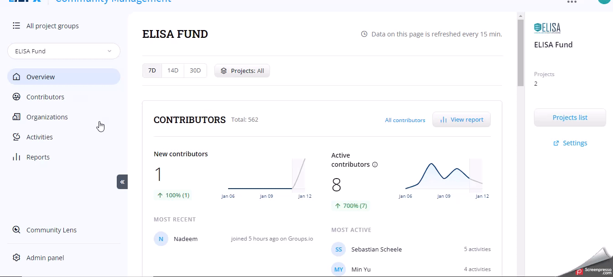

# Quick Start Guide

Community Management (CM) is simplifying complex data for better decision-making. It tracks contributor interactions across platforms like GitHub, Git, Groups.io and Twitter, providing analytics-driven insights and identifying key contributors and organizations for effective community support.

To get started, refer to this quick start guide.

### Sign in to the CM Application

1. Visit the [ https://cm.lfx.dev/](https://cm.lfx.dev/) login page.
2. Enter your credentials (username and password). If you don't have access, raise a support ticket on the [support portal.](https://jira.linuxfoundation.org/plugins/servlet/desk/portal/4)

### Connect Your Data Sources

To see the data flowing on your CM portal, connect a few data sources.&#x20;


It is preferable to use multiple data sources; however, if you start with only one, we recommend GitHub since it has a lot of developers' data, which we enhance by adding more data points for your use.


1. Once logged in, you will see the projects to which you have access under the [**My** **Project Groups**](project-groups-page/) tab. Raise support ticket on the[ support portal.](https://jira.linuxfoundation.org/plugins/servlet/desk/portal/4) if you do not see your project cards for your projects.&#x20;
2.  Click **Settings** button under the project group that you want to onboard

    <figure><figcaption></figcaption></figure>
3.  Click **Manage Integrations** for the project you want to onboard.

    <figure><figcaption></figcaption></figure>
4.  Connect your preferred data sources to start pulling information. For more information, see [Integrations](integrations/). If you need assistance, contact the onboarding team for further guidance.&#x20;

    <figure><figcaption></figcaption></figure>
5. Once the data sources are integrated, your workspace will soon be populated with your contacts and organization pages.


The **Settings** CTA on the project cards is available only if you have admin access to your project. You cannot edit project settings for other project groups. If you don't see Settings button for your projects raise support ticket on the[ support portal.](https://jira.linuxfoundation.org/plugins/servlet/desk/portal/4)


<figure><figcaption></figcaption></figure>

### Search and View Projects

From the Project Groups page, click the **View Project(s) CTA** to explore details. For more information, see [Home Page](project-groups-page/).

<figure><figcaption></figcaption></figure>

### Explore Contributors and Organizations

1.  Click **Overview** link to find

    * Most active and most recent contributors
    * New organizations and the most active organizations.
    * New activities and top activities

    <figure><figcaption></figcaption></figure>
2. From the left navigation, click **Contributors** to explore and edit contributors on the dedicated **Contributors** page. Explore contributors based on affiliation, engagement, and time of contribution, or create your contributor report. You can also click on individual contributors to see more details about contributors; such as location, work experience, list of contributor's activities, etc.

<figure><figcaption></figcaption></figure>

3. From the left navigation, click **Organizations** to gain insights into contributing organizations. Explore these Organizations in terms of contributions and number of contributors, or search organizations by name. You can also click on individual organizations to see more details about this org, like description, list of contributors, list of activities for this org, etc.

<figure><figcaption></figcaption></figure>

4. From the left navigation, click **Activities** to see a list of activities for the selected project, with the ability to filter them by various criteria.

<figure><figcaption></figcaption></figure>

5. From the left navigation, click **Reports** to see default reports about Contributors, Organizations, and Activities, or create your report.

<figure><figcaption></figcaption></figure>

Congratulations! You've successfully navigated through the initial steps of **Community Management**.&#x20;

If you have any questions or need further assistance, refer to the help documentation or contact our support team.

