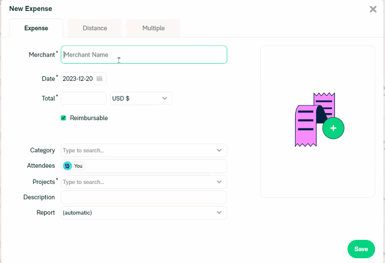

# Create and Submit an Expensify Report

Beneficiaries submit their requests for project-related expenses for reimbursement through Expensify.

Consolidate all your expenses that are eligible for reimbursement and upload them on Expensify.

Follow these steps to submit your expense report:

1. Sign in to [https://www.expensify.com/signin](https://www.expensify.com/signin).
2. From the left navigation, click **Expenses.**
3. On the Expenses page, click the **New Expense** drop-down.
4. From the drop-down, click **Manually Create.**

<figure><figcaption></figcaption></figure>

5. On the **New Expense** page, enter the following details under the **Expense** tab:&#x20;

<figure><figcaption></figcaption></figure>

* In the Merchant field, enter your name.
* Select the date of the expenses from the **Date** option.
* Enter the total expense. By default, the currency is USD $.
* Select your category from the drop-down. You must submit your expenses in any of these three categories: **Security Audit,** **General Fund**, or **Other**.
* Select your project from the drop-down.
* Write the description of your expenses.
* Click  icon to upload your receipt.

6. Click **Save** to submit the report**.**\
