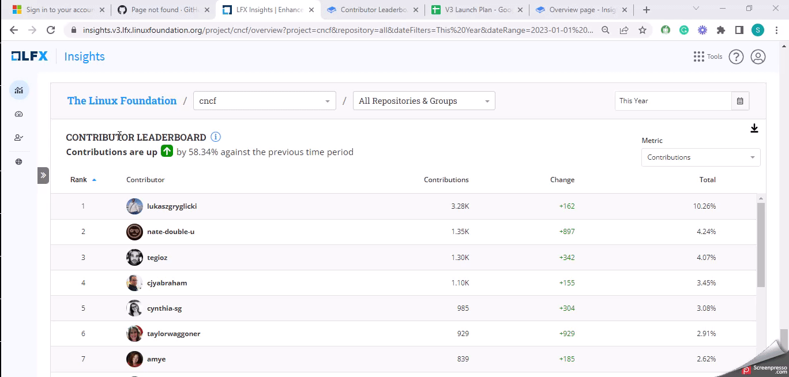

# Contributor Leaderboard

A **Contribution Leadership** board visualization displays the contributions made by individual contributors to an open source project. It ranks contributors based on the number of code commits, pull requests, issues closed, or other metrics and visually represents their relative activity levels and impact on the project.


This chart displays individual identities, not merge contributors, as in [Community Management](../../../../community-management/) tool. Even if we combine some identities in CM, they will still show up as different ones in the Insights V3 leaderboard.

Merging contributors refers to combining the contributions of a single individual who may have been working under different user accounts.&#x20;

This can happen when a contributor has multiple git configurations or submits pull requests from different email addresses.

Merging these accounts into a single identity ensures the accuracy of the leaderboard and gives a true representation of an individual’s contributions.


### Analyze the leaderboard

<figure><figcaption></figcaption></figure>

### Why is this metric important?

* **Recognition and Motivation:** The **Contributor Leaderboard** recognizes and acknowledges the efforts of individual contributors. It highlights their contributions, encourages ongoing engagement, and motivates contributors to continue their valuable work.
* **Community Engagement:** It creates a sense of community and healthy competition, encouraging collaboration and inspiring others to contribute and improve their ranking on the leaderboard.
* **Collaboration Opportunities:** The leaderboard helps project maintainers and community members identify potential collaborators or subject-matter experts within the project. It will be easier to identify the most active contributors and connect with them.
