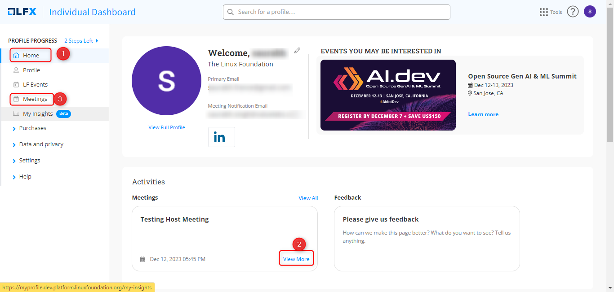
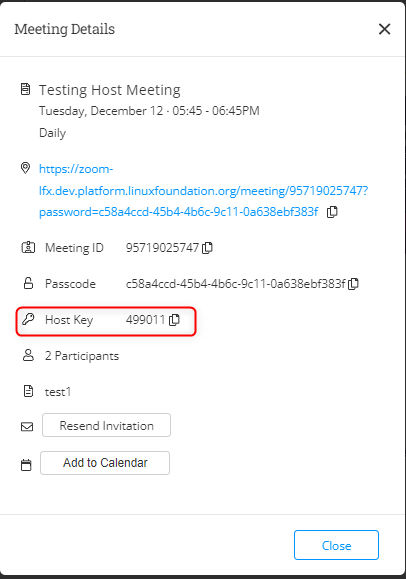
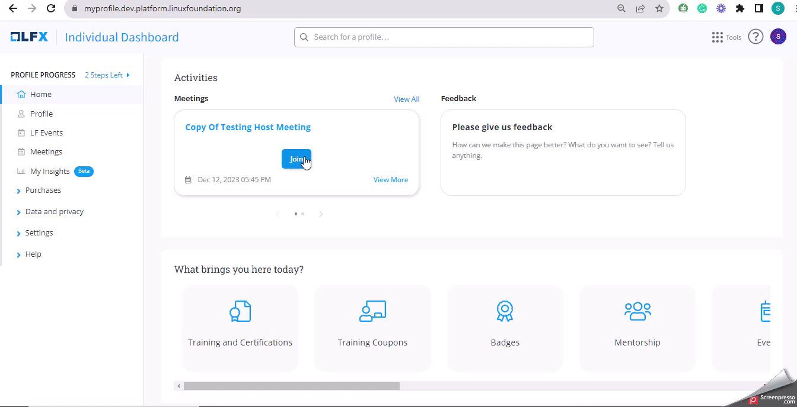

# Find Your Host Key

You will need the meeting link and host key provided in the invitation to join as a host. The following steps help you through the process of joining a meeting as a host that you have been invited to and assigned the host role.

For more information about meeting management in [PCC](https://projectadmin.lfx.linuxfoundation.org/), see [Meetings](https://docs.linuxfoundation.org/lfx/project-control-center/v2-latest-version/collaborations/meetings).

### **Prerequisites:**

* You must have been invited to the meeting and assigned the host role.
* You must have valid credentials to log in to the Individual Dashboard.

### Steps

#### 1. Open the meeting invitation.

1. On the **Individual Dashboard Home** page, you will see all the upcoming meetings under Activities.&#x20;
2. Click **View More** to see the meeting details, such as the meeting link, meeting ID, host key, etc.&#x20;
3. Alternatively, you can visit **Meetings>MY Meetings> Upcoming Meetings** from the left navigation to see the details of upcoming meetings.

<figure><figcaption></figcaption></figure>


You can only find the host key if you are assigned as a host for that meeting. The host key appears within one hour of the meeting and is valid for the next 40 minutes.


<figure><figcaption></figcaption></figure>

#### 2. Join the Meeting and Claim as a host

1. Look for the `Meeting Link` within the meeting details.
2. Click on the link to open the meeting in your web browser or preferred meeting application.
3. You will be prompted to join the meeting.
4. Click on **Join a Meeting** to join as an attendee.
5. Look for the option to "Claim as a Host" within the meeting interface. Click on this option.
6. Enter the host key provided in the meeting invitation.
7. Click on Confirm to claim the host role.
8. You will be notified if the host key is valid and you have been successfully assigned the host role.

Manage the Meeting

Once you are the host, you will have access to additional features such as:

* Muting and unmuting participants
* Sharing your screen
* Recording the meeting
* Adding or removing participants

<figure><figcaption></figcaption></figure>
