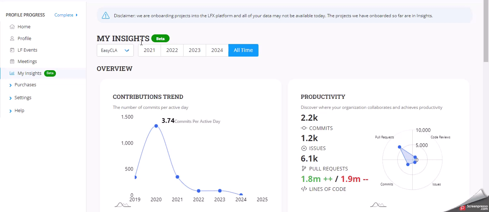

# My Insights Beta Version

This page presents a data analytics dashboard highlighting my contributions to various open-source projects over a selected period.&#x20;

It includes detailed metrics and visualizations to help understand the impact and scope of my involvement in the open-source community.

### Analyze the dashboard

#### How to Analyze Your Contributions on the Insights Dashboard

Follow these steps to analyze your contributions to open-source projects using the Insights dashboard:

1. **Select a Project**: At the top of the dashboard, select the project you want to analyze from the drop-down. By default, metrics are displayed for `ALL Projects`.
2. **Choose a Period**: Next to the project dropdown, you can select the period for which you want the data to be analyzed.

**Overview Section**

This section gives you a broad perspective on your contributions.

* **Contributions Trend**: This graph displays the number of contributions you've made during the selected period, along with the total commits per active day. This metric helps in evaluating your activity and consistency.
* **Productivity Metrics**: Under this category, you will see the data on your overall contribution, including total commits, issues raised, pull requests, and lines of code. This information is key to understanding what and how much you contribute.

**Details Section**

Dive deeper into specifics with these metrics:

1. **Projects We Contribute Code To**: Here, you can see a detailed breakdown of your contributions to various projects.
2. **Work Time Distribution**: This metric shows how your contributions are distributed over time, allowing you to understand your work patterns better and plan your participation in projects more effectively.

**Major Open Source Projects**

The dashboard lists the two most popular open source projects with the maximum contributions. If you want, you can contribute to these projects.

<figure><figcaption></figcaption></figure>

By following these steps and analyzing the provided metrics, you can gain valuable insights into your open-source project contributions, identify areas for improvement, and better plan your future involvement.
