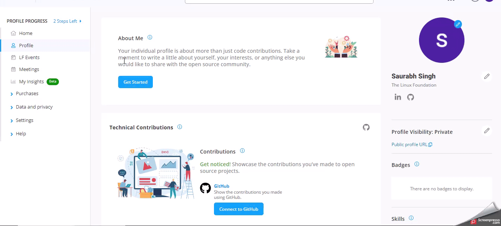

# Profile

On the left navigation pane of the **Individual Dashboard**, you will see the **Profile** section. Navigating through the various options on this page will help you get acquainted with your dashboard.

Here you can build your profile, add something about yourself, your contributions, the projects you support, the training that you have completed,  the certificates you received, your skill sets, and your badges, and change your profile photos. Moreover, you can keep your profile either private or visible to your community.

<figure><figcaption></figcaption></figure>

For more information, read the [documentation](../profile/).


After completing your LFX profile, if you do not see your details on the Profile page, click Request Addition to raise a support ticket.

