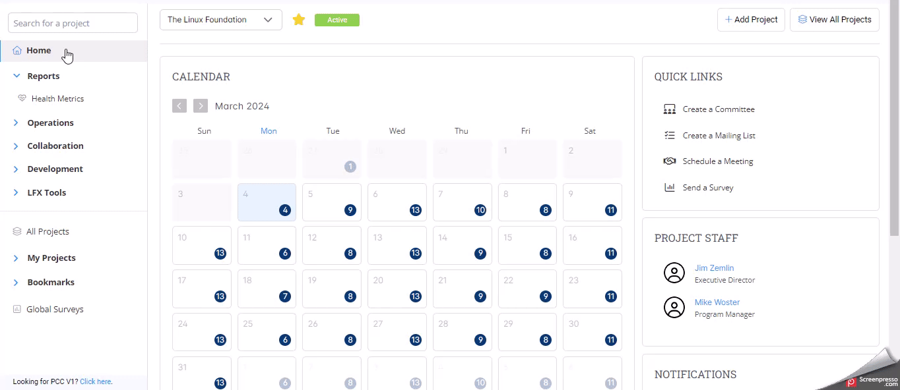

# Add Documents to Past Meetings

PCC has enhanced its functionality by allowing users to attach document links to previous meetings. This improvement facilitates better record maintenance and easier access to notes.

#### How to Add Documents to Past Meetings in PCC

1. Navigate to the PCC home page and locate the calendar.
2. Select the date of the Past meeting that you want to manage.
3. Click the next to the past meeting.
4. From the options, click **Manage Attachments**.

<figure><figcaption></figcaption></figure>

5. In the pop-up window, select the type of document you want to attach from the drop-down menu.
6. Enter the URL of the document in the designated field.
7. Click **Add** to attach the document to the meeting.
8. The document will now be attached and visible in the meeting’s records.

<figure><figcaption></figcaption></figure>

**Alternate Method to Add Documents to Past Meetings in PCC**

1. From the PCC home page, click on **Collaboration** > **Meetings** from the left navigation menu.
2. On the calendar view, select the date of the past meeting you wish to manage.
3.  Follow [steps 3](add-documents-to-past-meetings.md#how-to-add-documents-to-past-meetings-in-pcc) onward from the above to attach the documents.

