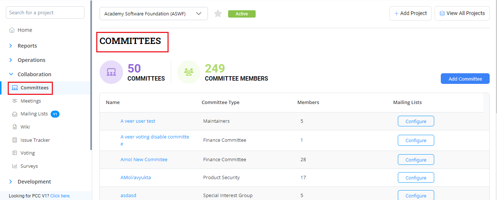
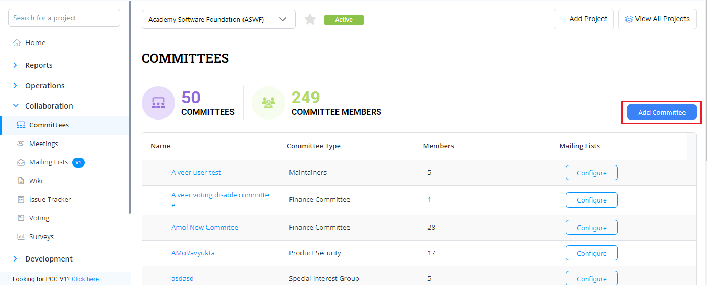
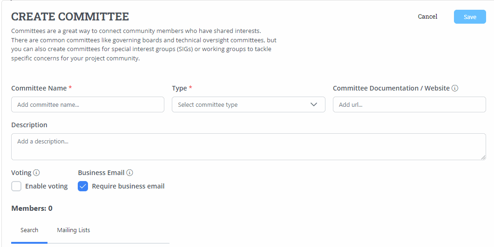

# Committees

Committee setup of project allows you to provide information on:

* ​Committee Overview​
* ​Committee​
* ​Adding Members​
* ​Deleting a Committee​
* ​Deleting a Member from a Committee​
* ​Manage Meetings​
* ​Manage Mailing List​

## Committee Overview 

The Committee overview section provides the overview information on:

* Total number of committee meetings
* Total number of meeting attendees
* Committee List table&#x20;

<figure><figcaption>
Committee 
</figcaption></figure>

## Add a Committee 

You can add and update committee information related to the project such as name, mailing list, committee website, permissions and description.

To add a committee for a project, perform the following steps:

1.Click on the required project and click **Committees** from the **Collaborations** tab.

<figure><figcaption>
Committee
</figcaption></figure>

2.The Committee page appears. Click **Add Committee** to add the committee details.

<figure><figcaption>
Add Committee 
</figcaption></figure>

3.The Create Committee page appears. Update the following details and click  **Save** to create a committee.

| **Field**                       | **Action**                                                                                                                        |
| ------------------------------- | --------------------------------------------------------------------------------------------------------------------------------- |
| Committee Name                  | Enter the name of the committee                                                                                                   |
| Description                     | Provide the description on the committee                                                                                          |
| Type                            | Select the type of committee that you want to create                                                                              |
| Enable Voting                   | Toggle the Enable Voting to enable the voting for the committee                                                                   |
| Committee Documentation/Website | Enter the committee website URL of the committee which can provide the committee details such as policies, meetings and schedules |

<figure><figcaption>
Create Committee 
</figcaption></figure>

### Import Members into a Committee  

You have an option to import members from the mailing list into the committee. To import members into the committee, perform the following steps:

1.Click **+Add Committee** to add the committee.

2.The Create Committee page. Enter the Committee Name, Select the committee Type and Click **Import Members**.

3.The Import Mailing Lists to Committee dialog box appears. Select the required Mailing Lists from the **Select Mailing Lists** drop down and click **Import**. All the members belonging to the selected mailing list are imported to the committee.

### Adding Members to a Committee 

After you setup the committee, you can add members to that committee who can exercise various responsibilities that are assigned to the members. To add a member to a committee, perform the following steps:

1.Click on the required project and click **Committees**.

2.The Committees page appears with the list of committees that are created for the project. Click the required committee where you want to add the members.

3.The selected committee page appears with list of members. Click **+ Add Member**.

4.The Add Committee Member dialog box appears. You can search for the member by providing their name or email.

5.If you are unable to add a member by providing their email ID or name. You can add them by clicking **Fill Out profile** link. The Add Committee Member dialog box appears. Update the following details and click **Save**:

| **Field**         | **Action**                              |
| ----------------- | --------------------------------------- |
| Name              | Enter the name of the member            |
| Email ID          | Enter the email ID of the member        |
| Company           | Enter the name of the company           |
| Job Title         | Enter the title for the member          |
| Appointed By      | Select the required appointed by        |
| Voting Status     | Select the required voting status       |
| Voting Start Date | Select the voting start date            |
| Voting End Date   | Select the voting end date              |
| Role              | Select the required role for the member |
| Role Start Date   | Select the role start date              |
| Role End Date     | Select the role end date                |

After adding a first member to a committee, if you want to add another member to a committee, you need to click the Committee and then click **Add Member** to add additional members to the committee.

* If a member has a verified LFID,icon is displayed.
* If a member LFID is pending for verification,icon is displayed.
* If a member does not have a LFID,icon is displayed.

### Send a Message  

You can send a message through mail to the member. To send a message to a member, perform the following steps:

1.Click on the required project and click **Committees**.

2.You can see the list of committees that are created for the project. Click the committee from which you want to remove or delete a member from a committee.

3.The Committee page appears with list of members in it. Click the clickicon and select **Send Message**.

4.Compose the mail and send it to the member.

### Mailing to Members 

You can share mail to all the members of the committee at once. To share mail to all the member of the committee, perform the following steps:

1.Click on the required project and click **Committees**.

2.You can see the list of committees that are created for the project. Click the committee from which you want to remove or delete a member from a committee.

3.The Committee page appears with list of members in it. Click **Email Members**.

4.The Email Committee dialog box appears. Click **Compose Email** to draft mail and share it with the all the members of the committee.

### Deleting a Member from a Committee 

You can delete a member from a committee as and when required. To delete a member, perform the following steps:

1.Click on the required project and click **Committees**.

2.You can see the list of committees that are created for the project. Click the committee from which you want to remove or delete a member from a committee.

3.The Committee page appears with list of members in it. Click Click the clickicon and select **Delete**.

4.The Delete Committee Member dialog box appears. Click **Delete** to remove a member from the committee.

### Managing Committees  

Manage committees allows you to edit, add subcommittee, move, manage members and delete the committee.

#### Updating the Committee 

You can update or modify the committee. To update the committee, perform the following steps:

1.Under Manage, click theand select **Edit**.

2.The Manage Committee dialog box appears. Update the committee as per your requirements and click **Save**.

#### Adding a Sub Committee  

You can also add a sub committee under a committee. To add a sub committee, perform the following steps:

1.Under Manage, click theand select **Add Subcommittee**.

2.The Add Sub Committee page appears. Enter the details as required and click **Next**.

3.You can also add members to the sub committee. Click Save to save the sub committee.

#### Moving a Committee into another Committee 

You can move a committee under an existing committee. To move a committee, perform the following steps:

1.Under Manage, click theand select **Move**.

2.The Move Committee dialog box appears. Select the committee under which you want to move the committee and click **Move**.

#### Deleting a Committee 

You can delete a committee if you want to. Deleting a committee will also remove all the members added in the committee. To delete a committee, perform the following steps:

1.Under Manage, click theand select **Delete**.

2\. The Delete Committee confirmation dialog box appears. Click **Delete** to delete the committee. A confirmation toast message appears informing that the committee has been deleted

### Managing Meetings 

Meetings related to committees are listed in the committees list under **Upcoming Meetings** tab. You can see the scheduled meetings and as well as schedule a meeting. On click of **Schedule**, the page navigates to Meeting Management to schedule a meeting.

### Managing Mailing List 

You can configure mailing list for your committees. On click of **Configure** available under **Mailing List**, the page navigates to **Mailing List**.
