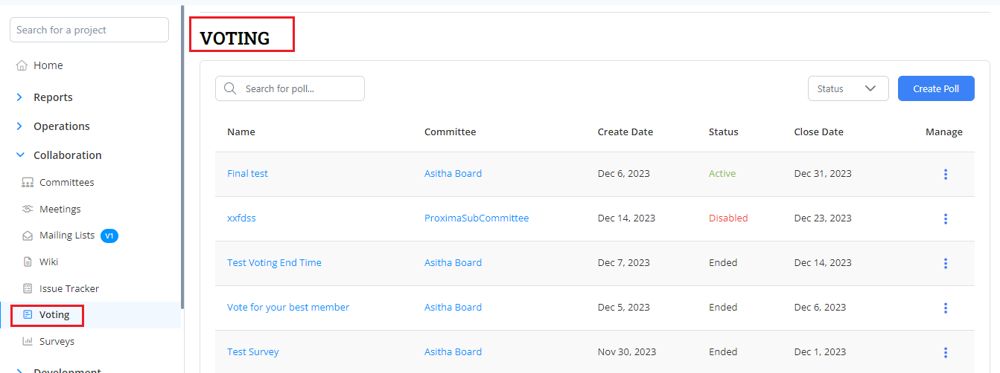
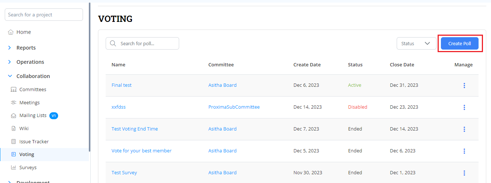
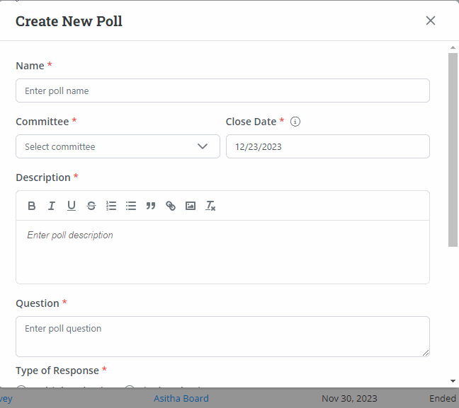
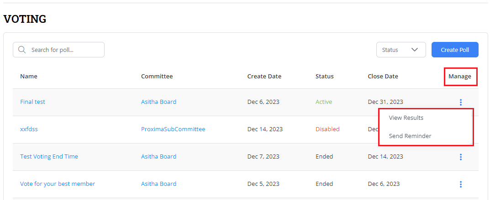
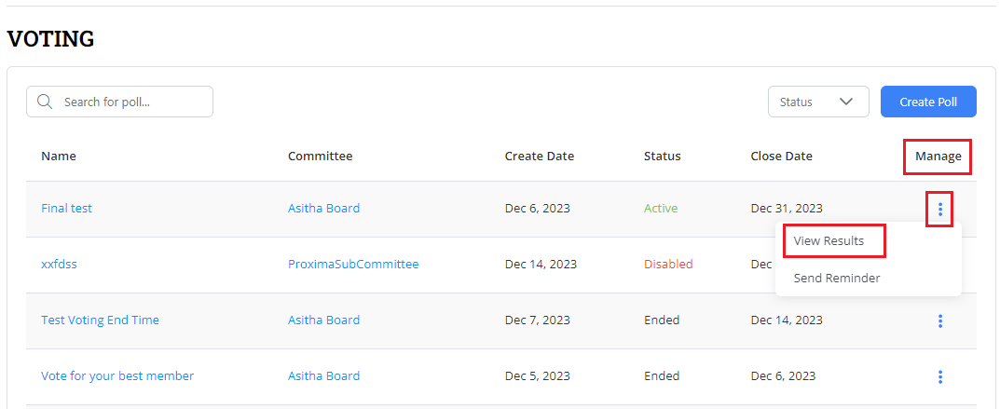
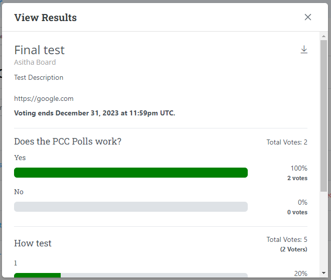
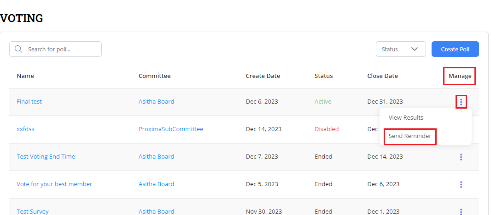
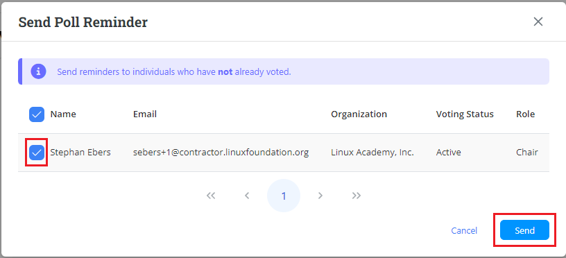

# Voting

Voting feature allows  you to create poll for a particular committee and share it to the committee members for the taking their vote.&#x20;

Voting page provides you with the lists of polls created for the voting. You can filter the voting based on status of the poll such as All, Active, Disabled and Ended.&#x20;

Voting list table provides the following details:

* Name of the poll
* Name of the committee for which poll has been created&#x20;
* Poll created date&#x20;
* Status of the poll&#x20;
* Poll end date&#x20;
* Managing the poll&#x20;

<figure><figcaption>
Voting 
</figcaption></figure>

## Creating a Poll&#x20;

You can create a poll to be voted for a particular committee. To create a poll, perform the following steps:

1.Log into the PCC.&#x20;

2.The Project dashboard appears. Click **Voting** from the **Collaboration** tab.

<figure><figcaption>
Voting 
</figcaption></figure>

3.Click **Create Poll**. &#x20;

<figure><figcaption>
Create Poll
</figcaption></figure>

4.The Create New Poll dialog box appears. Enter the following details and click Save.&#x20;

| Field              | Description                                                        |
| ------------------ | ------------------------------------------------------------------ |
| Name               | Provide the name of the poll                                       |
| Committee          | Select the  required committee for which you have created the poll |
| Close Date         | Enter the date for closing the poll                                |
| Description        | Enter a short description for the poll                             |
| Question           | Enter the polling question                                         |
| Type of Response   | Select the required response for the entered question              |
| Option 1, Option 2 | Enter the options                                                  |


Click **+ Add Option** and **+ Add Question** links to add multiple options and questions.&#x20;


<figure><figcaption>
Creating Poll 
</figcaption></figure>

## Managing Poll

You can manage a poll that has been created. You can view the results of the poll as well as send the reminders for the committee members to the participate in polls.&#x20;

<figure><figcaption>
Manage Poll 
</figcaption></figure>

### View Results

To view results of the poll, perform the following steps:

1.Click the  icon under Mange and click **View Results**.&#x20;

<figure><figcaption>
View Results
</figcaption></figure>

2.The View Results dialog box appears with results details.&#x20;


On click of download icon, you can download the results in an image format.&#x20;


<figure><figcaption>
View Results 
</figcaption></figure>

### Send Reminder

To send the reminder to the committee members to participate in the poll , perform the following steps:

1.Click the  icon under Mange and click **Send Reminder**.&#x20;

<figure><figcaption>
Send Reminder 
</figcaption></figure>

2.The Send Poll Reminder dialog box appears. Select the required members and click **Send** to send the reminder.&#x20;


You can only send the reminders to the members who have not voted.&#x20;


<figure><figcaption>
Send 
</figcaption></figure>
