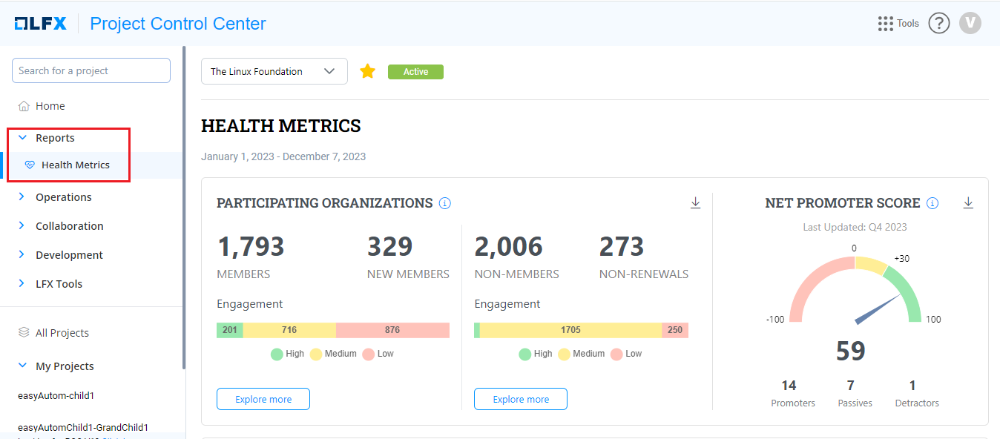

# Health Metrics

Health Metrics provides a dashboard for all onboarded projects that shows a quick snapshot of the project's health by combining metrics from the [OSSF Scorecard](https://github.com/ossf/scorecard) project and the [CNCF CLOMonitor](https://github.com/cncf/clomonitor) project to compute projects' overall best practices score.

The following are the main objectives of this feature :

* Provide visibility to the projects on areas to improve as per the OSS best practices guidelines for project setup.
* Monitor the project's health and take immediate action when the same starts deteriorating.
* Act as a checklist for the projects when they are ready to Graduate.

### Step-by-Step Guide to Utilize Health Metrics

Accessing the Health Metrics for your project is straightforward:

1. Log into your PCC account.
2. Navigate to the project of interest.
3. Click on the 'Reports' tab.
4. Select 'Health Metrics' to view the project's health report.

## Accessing Health Metrics&#x20;

To access the Health Metrics report, perform the following steps:

1. Login into your PCC account.
2. Search the required project.&#x20;
3. Click on the 'Reports' tab.
4. Select **Health Metrics** to view the project's health report.

<figure><figcaption>
Health Metrics 
</figcaption></figure>
