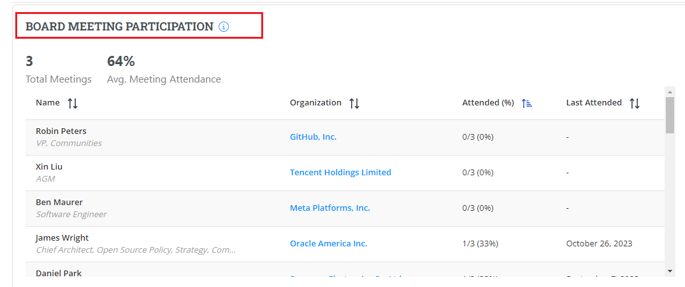

# Board Meeting Participation

Board Meeting Participation is recorded at 100% for an organization when at least one of its eligible members attends the meeting. In this metric, only voting or alternative voting representatives are considered eligible. The calculation considers all past board meetings held within the current year.&#x20;

Board Meeting Participation provides the following details:

* Total number of meetings attended&#x20;
* Percentage of meeting attendance&#x20;
* Name of the member who attended the meeting&#x20;
* Organization Name&#x20;
* Percentage of meetings attended&#x20;
* The last meeting attended


You will be navigated to the member details page by clicking the organization name. For more information, refer to [Member Details](https://docs.linuxfoundation.org/lfx/project-control-center/v2-latest-version/reports/health-metrics/participating-organization#exploring-participating-organization-for-members). &#x20;


<figure><figcaption>
Board Meeting Participation 
</figcaption></figure>

