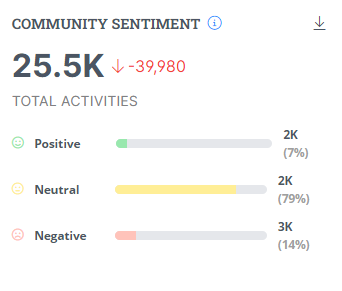

# Community Sentiment

**Community Sentiment** reflects the overall mood and activity level surrounding your project based on user activity.

Sentiment analysis is a natural language processing (NLP) technique used to determine the sentiment expressed in a piece of text, whether it's positive, negative, or neutral.

It can be measured through various metrics, such as engagement on social media platforms, comments on forums, and interaction rates on project updates.

**Key components:**

* **Total Activities:** This represents the total number of actions taken by users within the project, such as comments, posts, and edits. Higher activity generally indicates a healthy and engaged community.
* **Sentiment Bars:** These bars display the distribution of sentiment across three categories:
  * **Positive:** represents positive feedback, comments, and overall engagement.
  * **Neutral:** represents neutral activity, such as information sharing without expressing strong opinions.
  * **Negative:** represents negative feedback, criticism, or concerns raised by users.

**Interpreting the metric:**

* A balanced distribution across all three bars suggests a healthy community with diverse perspectives.
* A dominant positive sentiment indicates a thriving and enthusiastic community.
* A significant negative sentiment might highlight issues requiring attention or improvement.

<figure><figcaption></figcaption></figure>
