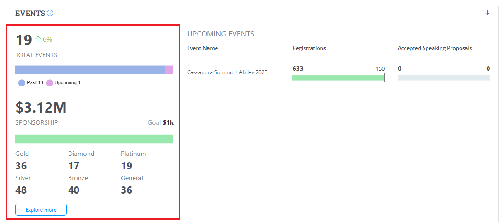
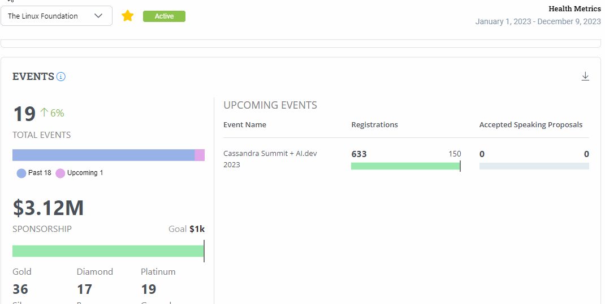
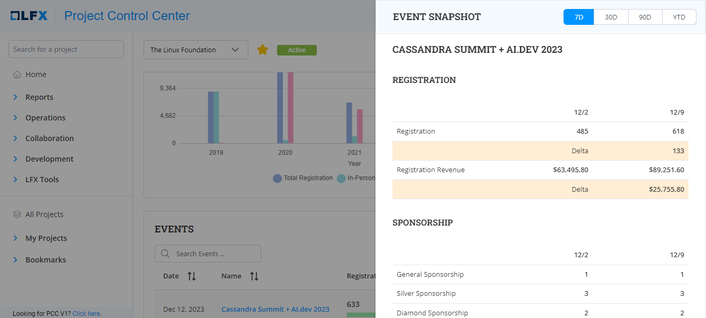
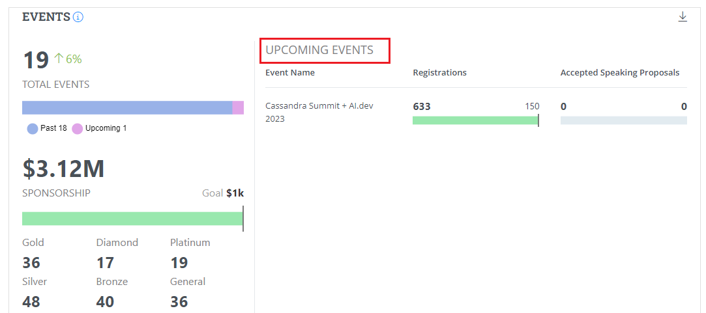

# Events

Events provides you with the health metrics for the events. The Events charts provides the following details:

* Total events bar graph
* Total event sponsorship
* Upcoming event details

<figure><figcaption>
Events
</figcaption></figure>

## Total Event

Total Events bar graph provides you the total events organized that comprises of past and upcoming events. It also provides you with the percentage of progress with respect to the events organized. You can also see the sponsorship for various membership such as Gold, Platinum, Diamond, Silver, Bronze and General.&#x20;

<figure><figcaption>
Total Events
</figcaption></figure>

### Exploring Events

On click of **Explore More**, you will be navigated to the Events details page. Events details page provides details provides various details related to the events for the current year. Events details page provides details such as:

* Total events bar graph
* Total event sponsorship
* A pictorial world map that provides details such as name of the place, total revenue and total registrants when you hover over a location.
* Event Attendance and Growth bar graph
* Events table &#x20;

<figure><figcaption>
Events Details 
</figcaption></figure>

On click of the event name, an event snapshot which provides:

* Event Name
* Registration details&#x20;
* Sponsorship details&#x20;

<figure><figcaption>
Event Snapshot
</figcaption></figure>

## Upcoming Events

Upcoming Events provides you with the details of the upcoming events that provides details such as total number of registration and the total goal that was set for the registration. It also provides you with the details related to the speakers. It gives you the total number of speakers accepted out of the total number of speakers registered.

<figure><figcaption>
Upcoming Events
</figcaption></figure>
