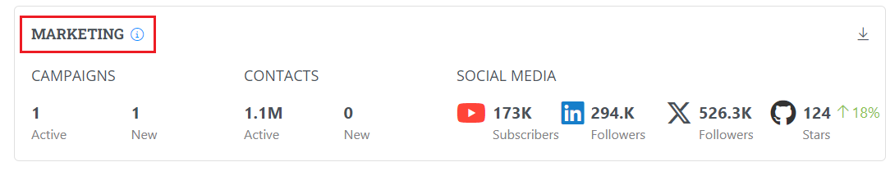

# Marketing

Marketing Health Metrics provides details related to the marketing campaigns for the project. It provides the following details:

* Number of active campaigns&#x20;
* Number of new campaigns hel
* Number of active contacts
* Number of new contacts
* Number of subscribers on YouTube&#x20;
* Number of followers on LinkedIn&#x20;
* Number of followers on X
* Number of stars on GitHub&#x20;
* Percentage of progression on the social media accounts&#x20;

<figure><figcaption>
Marketing 
</figcaption></figure>
