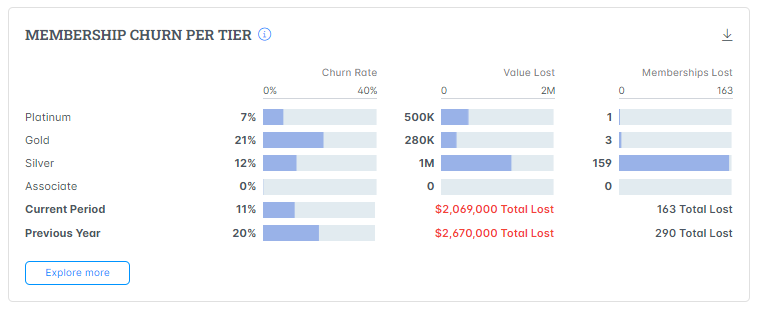

# Membership Churn

The **Membership Churn** metric tracks the rate of members who have stopped their membership for your project within the selected period.


Free membership account data is excluded from this metric, and downgrades are included in lost members.


### Key Metrics

<figure><figcaption></figcaption></figure>

### Member Churn Rate

This percentage indicates the proportion of members who stopped their subscription or membership compared to the total number of members in a specific period. A lower churn rate is generally desirable.

### Membership Value Lost

This represents the estimated value lost due to member churn. It calculates the financial impact of members discontinuing their subscriptions or memberships.

### Membership Lost

This chart illustrates the churn rate across different membership tiers such as platinum, gold, and silver.  The vertical bar chart highlights,  which membership tiers are experiencing higher levels of churn, providing insights into where improvements can be made to retain members and reduce overall membership value lost.

### Explore More&#x20;

Click **Explore More** CTA to navigate to the detailed dedicated page where you can see the specific factors contributing to membership churn, view historical trends, and analyze patterns over time.
