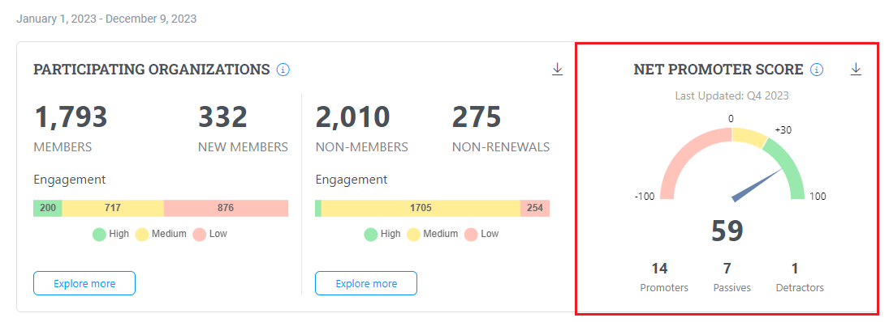

# Net Promoter Score (NPS)

#### Net Promoter Score (NPS)

Net Promoter Score (NPS) is an index ranging from -100 to 100 that measures the willingness of customers to recommend a company's products or services to others. This metric is a reliable indicator of a customer's satisfaction level with a company's product or service and their allegiance to the brand.

**How to Calculate NPS**

The score is calculated by taking the difference between the percentage of promoters and the percentage of detractors, using the following formula:

```
NPS = % Promoters - % Detractors
```

**Understanding NPS Ranges**

* **Promoters** (score 9-10) are loyal enthusiasts who will keep buying and referring others, fueling growth.
* **Passives** (score 7-8) are satisfied but unenthusiastic customers who are vulnerable to competitive offerings.
* **Detractors** (score 0-6) are unhappy customers who can damage your brand and impede growth through negative word-of-mouth.

An **NPS score between 30 to 100 is generally considered excellent** and indicates that a company has far more promoters than demoters.

**NPS Chart**

The NPS chart visually presents the numbers of:

* **Promoters**
* **Passive users**
* **Detractors**

The chart helps companies quickly grasp their NPS distribution and track improvements or declines in customer satisfaction over time.

<figure><figcaption><p>NPS</p></figcaption></figure>
