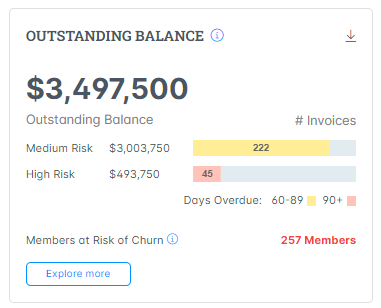

# Outstanding Balance

High-RiskThis widget displays the total outstanding balance owed by members, categorized into two risk levels:

* High Risk: Amount overdue for more than 89 days, including members who haven't renewed.
* Medium Risk: Amount overdue between 1 and 89 days.


All the metrics in this widget are manually updated every Friday at 4 pm PT.&#x20;


<figure><figcaption></figcaption></figure>

### Explore more

#### How to Utilize the "Explore More" Feature for Outstanding Balances

1. Click  the **Explore More** Call-to-Action (CTA) to access the detailed Outstanding Balance page.
2. On the Outstanding Balance page, you will find the **Memberships at Risk** list, showcasing all members with overdue payments categorized by risk level.
3. To filter and view only **High Risk** Members:
   * Click on the toggle button located at the top of the list. This will filter out Medium Risk members, allowing you to focus on members with dues overdue for more than 89 days.
4. To view detailed information about a specific member:
   * Browse through the list and click on the name of the member you are interested in. This action will redirect you to that member's details page.

By following these steps, you can effectively manage and prioritize outreach to members based on the risk level of their outstanding balances.
