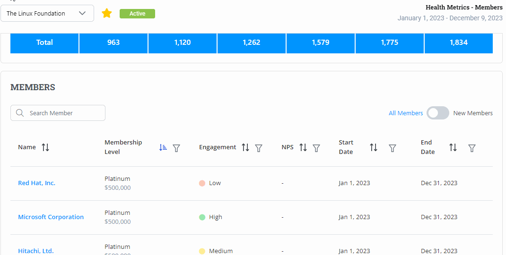

# Participating  Organization

**Participating Organization Health** Metric provides engagement scores for members and non-members. Engagement score is calculated for every participating organization.  Engagement score is classified into three levels High, Medium, and Low.&#x20;

The engagement score is derived from the following engagements:

* Board Meeting Attendance&#x20;
* Event Attendance&#x20;
* Code Contribution &#x20;
* Mailing List Contributions&#x20;
* Training and Certification&#x20;
* Event Sponsorship&#x20;
* Corporate Training Purchases&#x20;
* Speaking Proposal Submissions&#x20;
* Satisfaction Levels&#x20;

The Participating Organization allows you to view the engagement score for members and non-members. The Participating Organization widget provides you with the following details:

* Number of Members&#x20;
* Number of new members&#x20;
* Engagement score bar for members&#x20;
* Number of non-members&#x20;
* Number of non-renewals&#x20;
* Engagement score bar for non-members

<figure><figcaption>
Participating Organization
</figcaption></figure>

## Exploring Participating Organization for Members

&#x20;When you click **Explore More**, you will be navigated to the Members details page. Members details page provides details provides various details related to the members for the current year. The members' details page provides details  such as:

* Member Widget
* Member Breakdown by Engagement Score bar
* New Member Growth by Year Line Graph
* Membership Breakdown by Tier Table
* Members table

<figure><figcaption>
Member Details  
</figcaption></figure>

### Member Widget

Member widget provides various details, such as:

* Total number of members
* Total number of new members
* Total number of non-renewals

<figure><figcaption>
Member Widget
</figcaption></figure>

### Member Breakdown by Engagement Score Bar

Member Breakdown by Engagement score bar provides the score of the members. The score of the members are categorized in High, Medium and Low.

<figure><figcaption>
Member Breakdown by Engagement score bar 
</figcaption></figure>

### New Member Growth by Year Line Graph

The New Member Growth by Year line graph provides the line graph of new member growth for the last 5 years. It provides the progression of the member growth every month for the last 5 years.

<figure><figcaption>
New Member Growth 
</figcaption></figure>

### Membership Breakdown by Tier table

Membership Breakdown by tier table provides you with the list of membership breakdowns for the last 6 years. It shows you the membership such as Platinum, Gold, Silver, and Associate membership availed by members in the last 6 years along with total membership details.

<figure><figcaption>
Membership Breakdown by Tier
</figcaption></figure>

### Members Table

The members table provides you with complete details of the members such as Member name, membership level, engagement of the member, NPS score, membership start date, and membership end date.


You can also use the toggle button to filter new members from all members list.


<figure><figcaption>
Members Table 
</figcaption></figure>

On clicking on the member name, you will be navigated to the Member Details page which provides:

* Member Name
* Membership Type
* Active contributors
* Total contributors
* Member engagement score
* Month-wise member engagement details in a bar graph for the last year
* Key Metrics used to calculate the member engagement growth.


On clicking the metric, you can see the percentage of the metric used to calculate the member engagement score.&#x20;


<figure><figcaption>
Members Details 
</figcaption></figure>

## Exploring Participating Organization for Non-Members

Click **Explore More**, you will be navigated to the Non-Members details page. The Non-Members details page provides various details related to the non-members for the current year. The Non-Members details page provides details  such as:

* Non-Member Widget
* Non-Member Breakdown by Engagement Score bar
* Non Members table

<figure><figcaption>
Non Members Participating Organization 
</figcaption></figure>

### Non-Member Widget

Non-Member widget provides various details such as:

* Total number of non-members
* Total number of new prospects&#x20;

<figure><figcaption>
Non Member Widget 
</figcaption></figure>

### Non-Member Breakdown by Engagement Score Bar

Non-Member Breakdown by Engagement score bar provides the score of the members. The scores of the non-members are categorized as High, Medium, and Low.

<figure><figcaption>
Non Member Breakdown by Engagement score bar 
</figcaption></figure>

### Non-Members Table

Non Members table provides you with complete details of the non-members such as Non Member name, engagement of the non-member, and other membership details.&#x20;

<figure><figcaption>
Non Members Details
</figcaption></figure>

On click of the non-member name, you will be navigated to the Non-Member Details page which provides:

* Non-Member Name
* Active contributors
* Total contributors
* Non-Member engagement score
* Month-wise member engagement details in a bar graph for the last year
* Key Metrics used to calculate the member engagement growth.


On clicking the metric, you can see the percentage of the metric used to calculate the non-member engagement score.&#x20;


<figure><figcaption>
Non Member Details 
</figcaption></figure>
