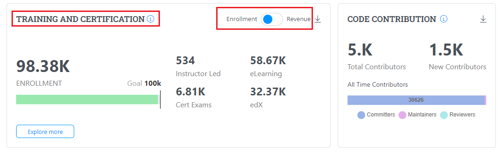
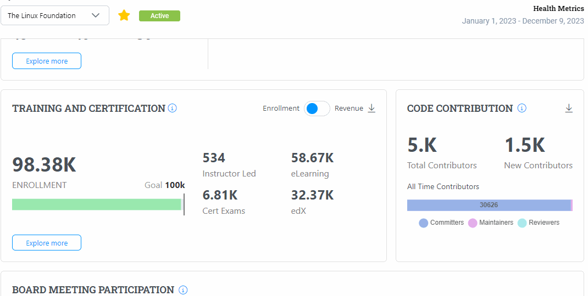
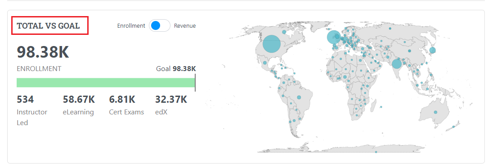
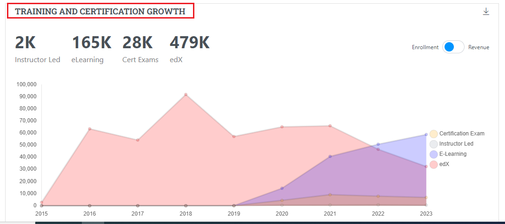
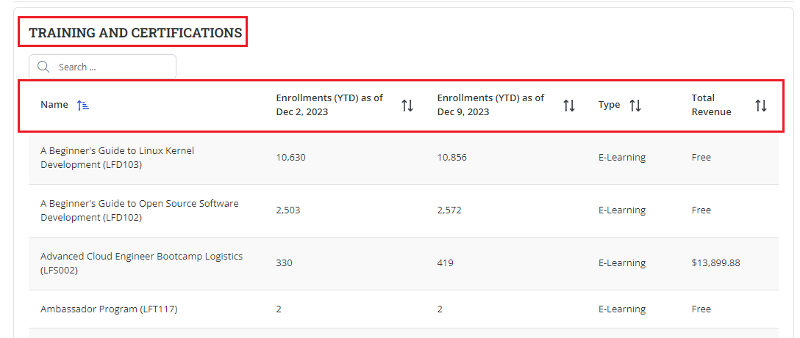

# Training and Certification

Training and Certification provides you with the health metrics for the Training and Certification with respect to enrollment and revenue.&#x20;

You need to use the toggle button to view details related to Enrollment and Revenue.&#x20;

The Training and Certification charts provides the following details related to enrollment:

* Enrollment goal chart
* Total number of Instructor led&#x20;
* Total number of certification exams
* Total number of elearning&#x20;
* Total number of edx

<figure><figcaption>
Training and Certification for Enrollment 
</figcaption></figure>

## Training and Certification Enrollment Details&#x20;

On click of **Explore More**, you will be navigated to the Training and Certification Enrollment details page. Training and Certification Enrollment details page provides details related to the Training and Certification for Enrollment for the current year. Training and Certification Enrollment details page provides details  such as:

* Total Vs Goal&#x20;
* Training and Certification Growth Graph
* Training and Certification table&#x20;

<figure><figcaption>
Training and certification Enrollment Details 
</figcaption></figure>

### Total Vs Goal&#x20;

Total Vs Goal chart provides the following details:

* Total number of enrollment&#x20;
* Enrollment goal chart
* A pictorial world map that provides details such as name of the place, total revenue and total registrants when you hover over a location.
* Total number of Instructor led&#x20;
* Total number of certification exams
* Total number of elearning&#x20;
* Total number of edx

<figure><figcaption>
Total Vs Goal 
</figcaption></figure>

### Training and Certification Growth  Chart

Training and Certification Enrollment Growth chart by year graph provides a dotted chart that shows the progression of Training and Certification Enrollment  for last 5 years. Its provides the progression of the growth based  on the certification exams, instructor led trainings, E-leanring and edX.&#x20;

<figure><figcaption>
Training and Certification Enrollment Growth chart
</figcaption></figure>

### Training and Certification Enrollment Table&#x20;

Training and Certification Enrollment table provides you with complete details of the Training and Certification Enrollment such as Training and Certification name, enrollment date, type and total revenue.

<figure><figcaption>
Training and Certification Enrollment table
</figcaption></figure>

